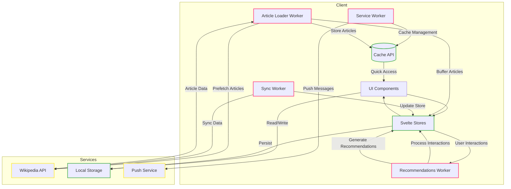

# WakaWiki

<div align="center">
  
  <p>A modern wiki reader with AI-powered recommendations and offline capabilities</p>
</div>

## Installation

Make sure you have [bun](https://bun.sh) installed:

```bash
# Install bun if you haven't already
curl -fsSL https://bun.sh/install | bash

# Clone the repository
git clone https://github.com/zxce3/wakawiki.git
cd wakawiki

# Install dependencies
bun install

# Run development server
bun dev

# Build for production
bun run build
```

## Features
- Progressive Web App (PWA) with advanced offline support
- Infinite vertical scrolling feed with smart article virtualization 
- Adaptive image loading with fallback system and loading states
- Support for multiple languages with smart language detection
- Advanced article recommendations through Web Workers
- Like/bookmark system with conflict-free persistent storage
- Smart content caching and prefetching with version control
- Double-tap to like interactions with haptic feedback (On Mobile)
- Project/Sponsor ads integration with viewability tracking
- Loading state indicators with custom animations
- Responsive design optimized for mobile and desktop

## Progressive Web App Features
- Full offline functionality with smart sync
- Background data synchronization
- Intelligent caching strategies
- Network-aware content delivery
- Window Controls Overlay on desktop
- Share target capabilities

## Tech Stack
- **SvelteKit**: Core framework for UI and routing
- **Web Workers**: 
  - Article loader worker for caching and prefetching
  - Recommendation engine with ML-based content analysis
  - Background sync coordination
- **Service Worker**:
  - Custom versioned caching strategies
  - Offline-first architecture
  - Protocol handler registration
  - Push notification management
- **TypeScript**: Full type safety across the codebase
- **TailwindCSS**: Advanced responsive styling
- **Workbox**: PWA tooling and caching
- **Wikipedia API**: RESTful content integration
- **Cache/Storage APIs**: 
  - IndexedDB for structured data
  - Cache API for response storage
  - LocalStorage for preferences

## Core Components
- Article loading worker for prefetching content
- AI recommendation worker for personalized suggestions
- Smart caching service for performance optimization
- Virtual scrolling system for memory efficiency
- Language management with persistent preferences
- Error recovery and retry mechanisms

## Performance Features
- Virtual DOM rendering for large article lists
- Progressive image loading with placeholders
- Smart throttling for API requests
- Memory-efficient article buffer system
- Strategic cache management
- Lazy loading with priority queuing

## Future Enhancements
- Enhanced offline functionality
- Cross-device synchronization
- Extended language support
- Advanced category exploration
- Social sharing features
- Reading history analytics
- Website anaytics

## Architecture


## Service Worker Features
- Advanced caching strategies:
  - Network-first with timeout for API requests
  - Cache-first with revalidation for images
  - Stale-while-revalidate for static assets
  - Version-based cache management
- Background sync queue management
- Push notification handling
- Protocol handler registration
- Share target handling
- Network status monitoring

## Cache Management
- Versioned article content caching
- Progressive image optimization and caching
- Category and metadata caching
- Smart cache invalidation with dependency tracking
- Language-specific cache segregation
- Cache storage quotas and cleanup

## Changelog

### [Unreleased]
#### Added
- PWA manifest link and improved service worker initialization
- Offline articles page with saved content functionality
- Online/offline detection with content refresh on reconnect
- Enhanced caching strategies for Wikipedia API
- Reload prompt for service worker updates
- Offline support for articles with notifications
- Background sync for articles
- SEO improvements with SvelteSeo component
- Double-tap to like functionality on mobile
- RelatedArticles component for linked articles
- Enhanced image loading with fallback system
- Virtual scrolling implementation
- Language-based cache management
- Batch article loading optimizations

#### Changed
- Optimized article loading and caching strategies
- Improved image loading states and transitions
- Enhanced recommendation system
- Refactored import paths to use absolute references
- Updated caching mechanisms for better offline support

#### Fixed
- Service Worker registration issues
- Cache versioning conflicts
- Image loading and validation
- Language initialization and persistence
- Article loading race conditions

## Contributing
Feel free to submit issues and pull requests. Please ensure all changes follow our PWA and offline-first architecture.

<!-- If this loads faster than Wikipedia, we'll name the next release "Jimmy Wales' Nightmare" -->