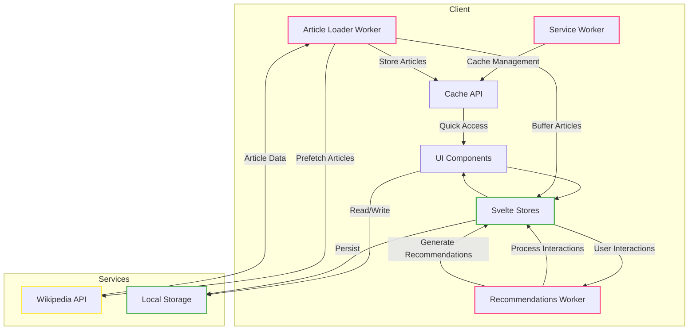

# WakaWiki

<div align="center">
  
  <p>A modern wiki reader with AI-powered recommendations and offline capabilities (Maybe?)</p>
</div>

## Installation

Make sure you have [bun](https://bun.sh) installed:

```bash
# Install bun if you haven't already
curl -fsSL https://bun.sh/install | bash

# Clone the repository
git clone https://github.com/zxce3/wakawiki.git
cd wakawiki

# Install dependencies
bun install

# Run development server
bun dev

# Build for production
bun run build
```

## Features
- Progressive Web App (PWA) with offline support
- Infinite vertical scrolling feed with smart article virtualization
- Adaptive image loading with fallback system and loading states
- Support for multiple languages with flag indicators
- Advanced article recommendations through Web Workers
- Like/bookmark system with persistent storage
- Related articles sidebar with content analysis
- Smart content caching and prefetching
- Double-tap to like interactions
- Project/Sponsor ads integration
- Loading state indicators with custom animations
- Responsive design optimized for mobile and desktop

## Progressive Web App Features
- Installable on desktop and mobile
- Works offline with cached content
- Background sync
- Push notifications (coming soon)
- Window Controls Overlay on desktop

## Tech Stack
- **SvelteKit**: Core framework for UI and routing
- **Web Workers**: 
  - Article loader worker for caching and prefetching
  - Recommendation engine with content analysis
- **Service Worker**:
  - Custom caching strategies
  - Offline support
  - Protocol handler
- **TypeScript**: Full type safety across the codebase
- **TailwindCSS**: Advanced responsive styling
- **Workbox**: PWA tooling and caching
- **Wikipedia API**: RESTful content integration
- **LocalStorage/Cache API**: Client-side data persistence

## Core Components
- Article loading worker for prefetching content
- AI recommendation worker for personalized suggestions
- Smart caching service for performance optimization
- Virtual scrolling system for memory efficiency
- Language management with persistent preferences
- Error recovery and retry mechanisms

## Performance Features
- Virtual DOM rendering for large article lists
- Progressive image loading with placeholders
- Smart throttling for API requests
- Memory-efficient article buffer system
- Strategic cache management
- Lazy loading with priority queuing

## Future Enhancements
- Enhanced offline functionality
- Cross-device synchronization
- Extended language support
- Advanced category exploration
- Social sharing features
- Reading history analytics

## Architecture


## Service Worker Features
- Smart caching strategies:
  - Network-first for API requests
  - Cache-first for images
  - Stale-while-revalidate for static assets
- Automatic cache cleanup
- Background sync (coming soon)
- Push notifications (coming soon)

## Cache Management
- Article content caching
- Image optimization and caching
- Category and metadata caching
- Smart cache invalidation
- Language-specific cache segregation

## Contributing
Feel free to submit issues and pull requests. Please ensure all changes follow our PWA and offline-first architecture.
