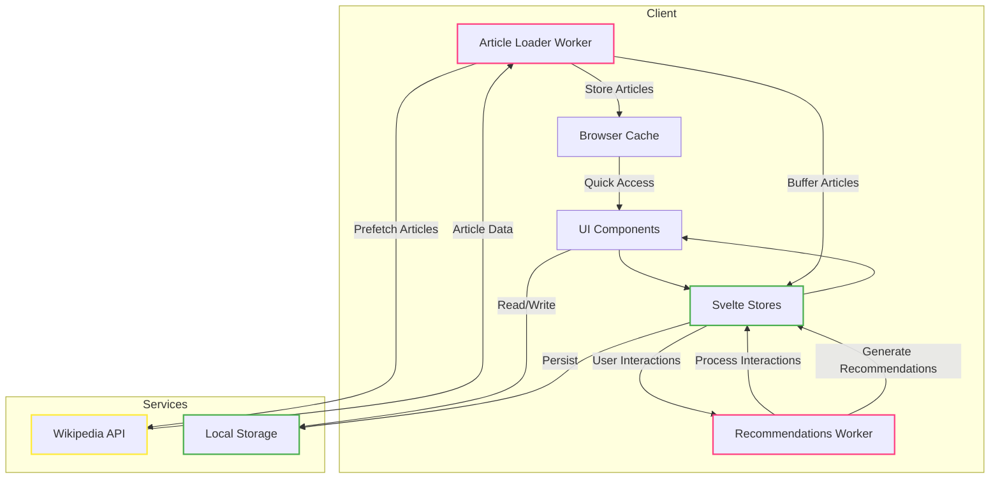

# WakaWiki

<div align="center">
  <svg width="120" height="120" viewBox="0 0 100 100">
    <defs>
      <linearGradient id="logoGradient" x1="0%" y1="0%" x2="100%" y2="0%">
        <stop offset="0%" style="stop-color:#ffffff;stop-opacity:0.2" />
        <stop offset="50%" style="stop-color:#ffffff;stop-opacity:1" />
        <stop offset="100%" style="stop-color:#ffffff;stop-opacity:0.2" />
      </linearGradient>
    </defs>
    <circle cx="50" cy="50" r="45" fill="none" stroke="url(#logoGradient)" stroke-width="4"/>
    <text x="50" y="65" text-anchor="middle" fill="white" style="font-size: 40px; font-weight: bold;">W</text>
  </svg>

  <p>A modern wiki reader with AI-powered recommendations</p>
</div>

## Installation

Make sure you have [bun](https://bun.sh) installed:

```bash
# Install bun if you haven't already
curl -fsSL https://bun.sh/install | bash

# Clone the repository
git clone https://github.com/yourusername/wakawiki.git
cd wakawiki

# Install dependencies
bun install

# Run development server
bun dev

# Build for production
bun run build
```

## Features
- Infinite vertical scrolling feed with smart article virtualization
- Adaptive image loading with fallback system and loading states
- Support for multiple languages with flag indicators
- Advanced article recommendations through Web Workers
- Like/bookmark system with persistent storage
- Related articles sidebar with content analysis
- Smart content caching and prefetching
- Double-tap to like interactions
- Project/Sponsor ads integration
- Loading state indicators with custom animations
- Responsive design optimized for mobile and desktop

## Tech Stack
- **SvelteKit**: Core framework for UI and routing
- **Web Workers**: 
  - Recommendation engine with content analysis
  - Article prefetching and caching system
- **TypeScript**: Full type safety across the codebase
- **TailwindCSS**: Advanced responsive styling
- **Wikipedia API**: RESTful content integration
- **LocalStorage/IndexedDB**: Client-side data persistence

## Core Components
- Article loading worker for prefetching content
- AI recommendation worker for personalized suggestions
- Smart caching service for performance optimization
- Virtual scrolling system for memory efficiency
- Language management with persistent preferences
- Error recovery and retry mechanisms

## Performance Features
- Virtual DOM rendering for large article lists
- Progressive image loading with placeholders
- Smart throttling for API requests
- Memory-efficient article buffer system
- Strategic cache management
- Lazy loading with priority queuing

## Future Enhancements
- Enhanced offline functionality
- Cross-device synchronization
- Extended language support
- Advanced category exploration
- Social sharing features
- Reading history analytics

## Architecture


## Contributing
Feel free to submit issues and pull requests.
